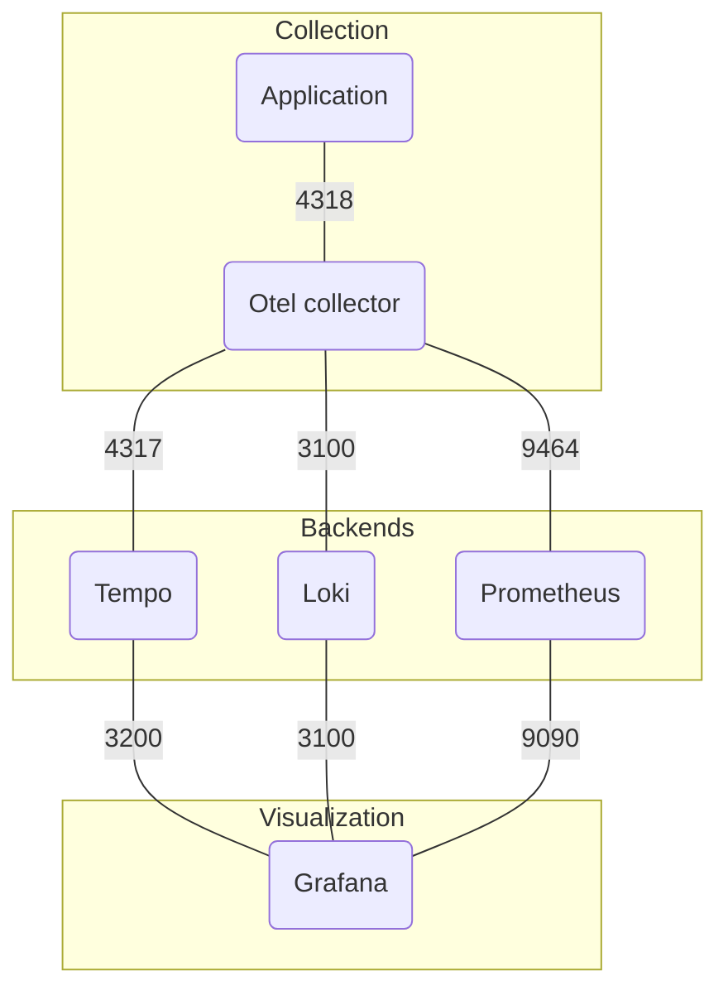

## 1. Setup o11y stack



Files:

|Files|Path|
|---|---|
|Stack config for Otel collector, Prometheus and Tempo|https://github.com/joetanx/o11y-lab/tree/main/stack/config|
|Configuration files for running stack as systemd services|https://github.com/joetanx/o11y-lab/tree/main/stack/podman-systemd|
|Manifest file for running as stack Kubernetes deployment |https://github.com/joetanx/o11y-lab/tree/main/stack/kubernetes|

### 1.1. Stack on Kubernetes

Setup stack directories

```sh
mkdir -p /etc/otelcol /etc/prometheus /etc/tempo /var/prometheus /var/tempo /var/loki /var/grafana
chown -R 65534:65534 /var/prometheus
chown -R 10001:10001 /var/tempo
chown -R 10001:10001 /var/loki
chown -R 472:472 /var/grafana
yum -y install policycoreutils-python-utils
semanage fcontext -a -t container_file_t "/var/prometheus(/.*)?"
semanage fcontext -a -t container_file_t "/var/tempo(/.*)?"
semanage fcontext -a -t container_file_t "/var/loki(/.*)?"
semanage fcontext -a -t container_file_t "/var/grafana(/.*)?"
restorecon -R -v /var/prometheus
restorecon -R -v /var/tempo
restorecon -R -v /var/loki
restorecon -R -v /var/grafana
```

Prepare stack configuration files

```sh
curl -sLo /etc/otelcol/config.yaml https://github.com/joetanx/o11y-lab/raw/main/stack/config/otelcol.yaml
sed -i 's/loki:3100/loki.o11y.svc.cluster.local:3100/' /etc/otelcol/config.yaml
sed -i 's/tempo:4317/tempo.o11y.svc.cluster.local:4317/' /etc/otelcol/config.yaml
curl -sLo /etc/prometheus/prometheus.yml https://github.com/joetanx/o11y-lab/raw/main/stack/config/prometheus.yml
sed -i 's/otelcol:9464/otelcol.o11y.svc.cluster.local:9464/' /etc/prometheus/prometheus.yml
curl -sLo /etc/tempo/tempo.yaml https://github.com/joetanx/o11y-lab/raw/main/stack/config/tempo.yaml
```

Deploy stack

```
kubectl create namespace o11y
kubectl -n o11y create configmap otelcol-config --from-file=/etc/otelcol/config.yaml
kubectl -n o11y create configmap prometheus-config --from-file=/etc/prometheus/prometheus.yml
kubectl -n o11y create configmap tempo-config --from-file=/etc/tempo/tempo.yaml
kubectl create -f https://github.com/joetanx/o11y-lab/raw/main/stack/kubernetes/o11y.yaml
```

### 1.2. Stack on Podman

#### 1.2.1. Setup preparation

Install packages and etup firewall rules

```sh
yum -y install podman jq container-selinux npm
firewall-cmd --permanent --add-port 3000/tcp --add-port 3100/tcp --add-port 3200/tcp --add-port 4317/tcp --add-port 4318/tcp --add-port 8080/tcp --add-port 9464/tcp --add-port 9090/tcp && firewall-cmd --reload
```

Setup stack directories

```sh
yum -y install podman jq container-selinux npm
firewall-cmd --permanent --add-port 3000/tcp --add-port 3100/tcp --add-port 3200/tcp --add-port 4317/tcp --add-port 4318/tcp --add-port 8080/tcp --add-port 9464/tcp --add-port 9090/tcp && firewall-cmd --reload
mkdir -p /etc/otelcol /etc/prometheus /etc/tempo /var/prometheus /var/tempo /var/loki /var/grafana
chown -R 65534:65534 /var/prometheus
chown -R 10001:10001 /var/tempo
chown -R 10001:10001 /var/loki
chown -R 472:472 /var/grafana
```

Prepare stack configuration files

```sh
curl -sLo /etc/otelcol/config.yaml https://github.com/joetanx/o11y-lab/raw/main/stack-config/otelcol.yaml
curl -sLo /etc/prometheus/prometheus.yml https://github.com/joetanx/o11y-lab/raw/main/stack-config/prometheus.yml
curl -sLo /etc/tempo/tempo.yaml https://github.com/joetanx/o11y-lab/raw/main/stack-config/tempo.yaml
```

Pull images (optional)

```sh
podman pull docker.io/otel/opentelemetry-collector-contrib:latest
podman pull docker.io/prom/prometheus:latest
podman pull docker.io/grafana/tempo:latest
podman pull docker.io/grafana/loki:latest
podman pull docker.io/grafana/grafana:latest
```

#### 1.2.2. Run stack

##### 1.2.2.1. Option 1: using Podman CLI

> [!Note]
>
> Does not auto start on host reboot

```sh
podman network create o11y
podman run --name otelcol -d -p 4317-4318:4317-4318 -p 9464:9464 --network o11y -v /etc/otelcol/config.yaml:/etc/otelcol-contrib/config.yaml docker.io/otel/opentelemetry-collector-contrib:latest
podman run --name prometheus -d -p 9090:9090 --network o11y -v /etc/prometheus/prometheus.yml:/etc/prometheus/prometheus.yml -v /var/prometheus:/prometheus:Z docker.io/prom/prometheus:latest
podman run --name tempo -d -p 3200:3200 --network o11y -v /etc/tempo/tempo.yaml:/etc/tempo.yaml -v /var/tempo:/var/tempo:Z docker.io/grafana/tempo:latest -config.file=/etc/tempo.yaml
podman run --name loki -d -p 3100:3100 --network o11y -v /var/loki:/loki:Z docker.io/grafana/loki:latest
podman run --name grafana -d -p 3000:3000 --network o11y -v /var/grafana:/var/lib/grafana:Z docker.io/grafana/grafana:latest
```

##### 1.2.2.2. Option 2: using systemd (quadlets)

```sh
url -sLo /etc/containers/systemd/o11y.network https://github.com/joetanx/o11y-lab/raw/main/stack/podman-systemd/o11y.network
curl -sLo /etc/containers/systemd/o11y-otelcol.container https://github.com/joetanx/o11y-lab/raw/main/stack/podman-systemd/o11y-otelcol.container
curl -sLo /etc/containers/systemd/o11y-prometheus.container https://github.com/joetanx/o11y-lab/raw/main/stack/podman-systemd/o11y-prometheus.container
curl -sLo /etc/containers/systemd/o11y-tempo.container https://github.com/joetanx/o11y-lab/raw/main/stack/podman-systemd/o11y-tempo.container
curl -sLo /etc/containers/systemd/o11y-loki.container https://github.com/joetanx/o11y-lab/raw/main/stack/podman-systemd/o11y-loki.container
curl -sLo /etc/containers/systemd/o11y-grafana.container https://github.com/joetanx/o11y-lab/raw/main/stack/podman-systemd/o11y-grafana.container
systemctl daemon-reload
systemctl start o11y-grafana
```

## 2. Node.js dice app

References:

|Topic|Link|
|---|---|
|Basic dice app|https://opentelemetry.io/docs/languages/js/getting-started/nodejs/|
|Instrumenting node.js|https://opentelemetry.io/docs/languages/js/instrumentation/|
|Configuring exporters|https://opentelemetry.io/docs/languages/js/exporters/|

Prepare app files:

```sh
mkdir /etc/dice
curl -sLo /etc/dice/app.js https://github.com/joetanx/o11y-lab/raw/main/dice-app/app.js
curl -sLo /etc/dice/functions.js https://github.com/joetanx/o11y-lab/raw/main/dice-app/functions.js
curl -sLo /etc/dice/instrumentation.js https://github.com/joetanx/o11y-lab/raw/main/dice-app/instrumentation.js
```

Prepare firewall rule (for Podman and manual install):

```sh
firewall-cmd --permanent --add-port 8080/tcp && firewall-cmd --reload
```

### 2.1. Run on Kubernetes

```sh
kubectl create namespace dice
kubectl -n dice create configmap dice-app --from-file=/etc/dice/app.js
kubectl -n dice create configmap dice-functions --from-file=/etc/dice/functions.js
kubectl -n dice create configmap dice-instrumentation --from-file=/etc/dice/instrumentation.js
kubectl create -f https://github.com/joetanx/o11y-lab/raw/main/dice-app/dice.yaml
```

### 2.2. Run on Podman

#### 2.2.1. Option 1: using Podman CLI

> [!Note]
>
> Does not auto start on host reboot

```sh
podman run --name dice -d -p 8080:3000 --network o11y -v /etc/dice:/etc/dice:Z -e OTELCOL=otelcol -e PORT=3000 -w /etc/dice docker.io/library/node:latest /bin/bash -c "npm install express winston @opentelemetry/sdk-node @opentelemetry/api @opentelemetry/auto-instrumentations-node @opentelemetry/sdk-metrics @opentelemetry/sdk-trace-node @opentelemetry/sdk-logs @opentelemetry/winston-transport @opentelemetry/exporter-trace-otlp-proto @opentelemetry/exporter-metrics-otlp-proto @opentelemetry/exporter-logs-otlp-proto && node --require ./instrumentation.js app.js"
```

#### 2.2.2. Option 2: using systemd (quadlets)

```sh
curl -sLo /etc/containers/systemd/dice.container https://github.com/joetanx/o11y-lab/raw/refs/heads/main/dice-app/dice.container
systemctl daemon-reload
systemctl start dice
```

### 2.3. Run via manual install

```sh
yum -y install npm
firewall-cmd --permanent --add-port 8080/tcp && firewall-cmd --reload
npm init -y
npm install express winston \
  @opentelemetry/sdk-node \
  @opentelemetry/api \
  @opentelemetry/auto-instrumentations-node \
  @opentelemetry/sdk-metrics \
  @opentelemetry/sdk-trace-node \
  @opentelemetry/sdk-logs \
  @opentelemetry/winston-transport \
  @opentelemetry/exporter-trace-otlp-proto \
  @opentelemetry/exporter-metrics-otlp-proto \
  @opentelemetry/exporter-logs-otlp-proto
curl -sLo /lib/systemd/system/dice.service https://github.com/joetanx/o11y-lab/raw/main/dice-app/dice.service
systemctl enable --now dice
```

### 2.4. Testing request to dice app

e.g. running on Podman with port publish on `8080`

```sh
curl http://o11y.vx:8080/rolldice?rolls=12
```

e.g. running on Kubernetes with ingress and cert-manager at `dice.vx`

```sh
curl -k https://dice.vx/rolldice?rolls=12
```
