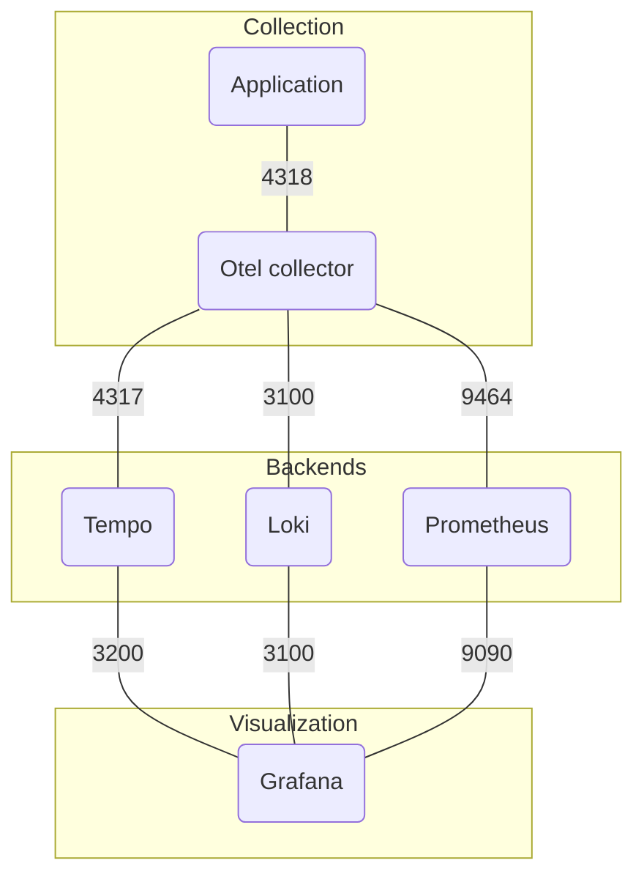

## 1. Setup o11y stack



### 1.1. Setup preparation

- Install packages
- Setup firewall rules
- Create stack directories
- Prepare stack configuration files

```sh
yum -y install podman jq container-selinux npm
firewall-cmd --permanent --add-port 3000/tcp --add-port 3100/tcp --add-port 3200/tcp --add-port 4317/tcp --add-port 4318/tcp --add-port 8080/tcp --add-port 9464/tcp --add-port 9090/tcp && firewall-cmd --reload
mkdir -p /etc/otelcol /etc/prometheus /etc/tempo /var/prometheus /var/tempo /var/loki /var/grafana
chown -R 65534:65534 /var/prometheus
chown -R 10001:10001 /var/tempo
chown -R 10001:10001 /var/loki
chown -R 472:472 /var/grafana
curl -sLo /etc/otelcol/config.yaml https://github.com/joetanx/o11y-lab/raw/main/stack-config/otelcol.yaml
curl -sLo /etc/prometheus/prometheus.yml https://github.com/joetanx/o11y-lab/raw/main/stack-config/prometheus.yml
curl -sLo /etc/tempo/tempo.yaml https://github.com/joetanx/o11y-lab/raw/main/stack-config/tempo.yaml
```

### 1.2. Run o11y stack

#### 1.2.1. Option 1: using podman CLI

> [!Note]
>
> Does not auto start on host reboot

```sh
podman network create o11y
podman run --name otelcol -d -p 4317-4318:4317-4318 -p 9464:9464 --network o11y -v /etc/otelcol/config.yaml:/etc/otelcol-contrib/config.yaml docker.io/otel/opentelemetry-collector-contrib:latest
podman run --name prometheus -d -p 9090:9090 --network o11y -v /etc/prometheus/prometheus.yml:/etc/prometheus/prometheus.yml -v /var/prometheus:/prometheus:Z docker.io/prom/prometheus:latest
podman run --name tempo -d -p 3200:3200 --network o11y -v /etc/tempo/tempo.yaml:/etc/tempo.yaml -v /var/tempo:/var/tempo:Z docker.io/grafana/tempo:latest -config.file=/etc/tempo.yaml
podman run --name loki -d -p 3100:3100 --network o11y -v /var/loki:/loki:Z docker.io/grafana/loki:latest
podman run --name grafana -d -p 3000:3000 --network o11y -v /var/grafana:/var/lib/grafana:Z docker.io/grafana/grafana:latest
```

#### 1.2.2. Option 2: using systemd (quadlets)

```sh
podman pull docker.io/otel/opentelemetry-collector-contrib:latest
podman pull docker.io/prom/prometheus:latest
podman pull docker.io/grafana/tempo:latest
podman pull docker.io/grafana/loki:latest
podman pull docker.io/grafana/grafana:latest
curl -sLo /etc/containers/systemd/o11y.network https://github.com/joetanx/o11y-lab/raw/main/stack/podman-systemd/o11y.network
curl -sLo /etc/containers/systemd/o11y-otelcol.container https://github.com/joetanx/o11y-lab/raw/main/stack/podman-systemd/o11y-otelcol.container
curl -sLo /etc/containers/systemd/o11y-prometheus.container https://github.com/joetanx/o11y-lab/raw/main/stack/podman-systemd/o11y-prometheus.container
curl -sLo /etc/containers/systemd/o11y-tempo.container https://github.com/joetanx/o11y-lab/raw/main/stack/podman-systemd/o11y-tempo.container
curl -sLo /etc/containers/systemd/o11y-loki.container https://github.com/joetanx/o11y-lab/raw/main/stack/podman-systemd/o11y-loki.container
curl -sLo /etc/containers/systemd/o11y-grafana.container https://github.com/joetanx/o11y-lab/raw/main/stack/podman-systemd/o11y-grafana.container
systemctl daemon-reload
systemctl start o11y-grafana
```
